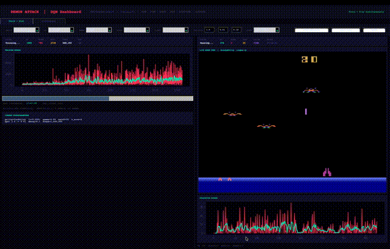
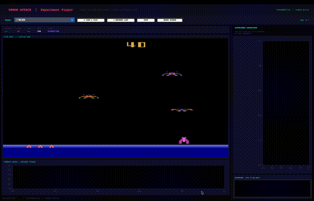
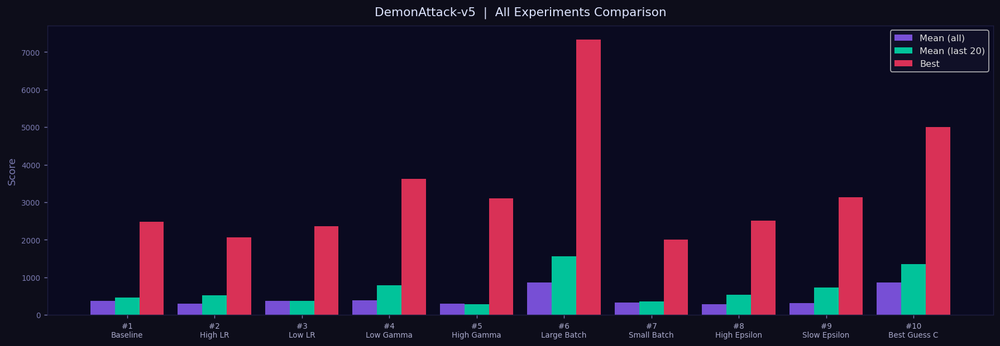

# Choosen Model among Team Members
# Deep Q-Learning — ALE/DemonAttack-v5

**Member:** Jean Robert Gatwaza  
**Environment:** `ALE/DemonAttack-v5`  
**Algorithm:** DQN — Stable Baselines 3  
**Policy:** `CnnPolicy` — all 10 experiments  

---

## Environment

| Property | Value |
|---|---|
| ID | `ALE/DemonAttack-v5` |
| Actions | `Discrete(6)` — NOOP, FIRE, RIGHT, LEFT, RIGHTFIRE, LEFTFIRE |
| Raw Obs | `Box(0, 255, (210, 160, 3), uint8)` |
| Preprocessed | `(84, 84, 4)` grayscale + 4 stacked frames |
| Frameskip | 4 — Repeat Action Prob: 0.25 |

---

## Installation

```bash
pip3 install stable-baselines3 "gymnasium[atari,accept-rom-license]" \
             ale-py autorom pillow matplotlib opencv-python
AutoROM --accept-license
```

---

## Files

| File | Purpose |
|---|---|
| `train.py` | Single training run |
| `run_experiments.py` | All 10 experiments — auto-resumable |
| `play.py` | Live evaluation GUI with experiment selector |
| `dqn_best.zip` | Best model — Exp 6 Large Batch |
| `hyperparameter_experiments.csv` | Full results |

---

## How to Run

```bash
# All 10 experiments
python3 run_experiments.py --timesteps 500000

# Single run
python3 train.py --lr 0.0001 --gamma 0.99 --batch 32 --timesteps 1000000

# Play and compare
python3 play.py --model dqn_best.zip

# Resume after crash — skips completed experiments automatically
python3 run_experiments.py --timesteps 500000
```

---

## Experiments — Gatwaza

`CnnPolicy` · `n_envs=4` · `500,000` timesteps · Total runtime: **665.3 min**

| # | Label | lr | gamma | batch | eps_end | eps_decay | Mean | Best | Last-20 |
|---|---|---|---|---|---|---|---|---|---|
| 1 | Baseline | 0.0001 | 0.99 | 32 | 0.01 | 0.10 | 376.8 | 2475.0 | 468.0 |
| 2 | High LR | 0.001 | 0.99 | 32 | 0.01 | 0.10 | 297.6 | 2070.0 | 525.8 |
| 3 | Low LR | 0.00001 | 0.99 | 32 | 0.01 | 0.10 | 376.3 | 2355.0 | 366.5 |
| 4 | Low Gamma | 0.0001 | 0.90 | 32 | 0.01 | 0.10 | 385.2 | 3620.0 | 792.0 |
| 5 | High Gamma | 0.0001 | 0.999 | 32 | 0.01 | 0.10 | 302.8 | 3110.0 | 288.5 |
| 6 | **Large Batch ★** | 0.0001 | 0.99 | **128** | 0.01 | 0.10 | **856.5** | **7330.0** | **1566.8** |
| 7 | Small Batch | 0.0001 | 0.99 | 16 | 0.01 | 0.10 | 322.8 | 2000.0 | 351.8 |
| 8 | High Eps End | 0.0001 | 0.99 | 32 | 0.10 | 0.10 | 278.9 | 2505.0 | 530.2 |
| 9 | Slow Eps Decay | 0.0001 | 0.99 | 32 | 0.01 | 0.50 | 311.1 | 3130.0 | 724.0 |
| 10 | Best Guess | 0.0005 | 0.995 | 64 | 0.01 | 0.15 | 862.9 | 5000.0 | 1348.8 |

**★ Best: Exp 6 — Large Batch · last-20 = 1566.8**

### Observations

**Exp 1 — Baseline:** Stable reference. last-20 (468) > mean (376.8) confirms the agent was still improving at end of training.

**Exp 2 — High LR:** Early instability lowers overall mean (297.6), but last-20 (525.8) recovers above baseline — convergence eventually stabilised.

**Exp 3 — Low LR:** last-20 ≈ mean — flat curve. lr=1e-5 produces too-small weight updates to converge within 500k steps.

**Exp 4 — Low Gamma:** Outperformed baseline (last-20=792.0). Short-sighted maximisation suits DemonAttack's immediate wave-based scoring — contrary to hypothesis.

**Exp 5 — High Gamma:** last-20 (288.5) < mean (302.8) — agent regressed. gamma=0.999 needs far more timesteps to form long-term strategies.

**Exp 6 — Large Batch ★:** Dominant. batch=128 → last-20=1566.8 (3.3× baseline), best=7330.0. Smoother gradients are highly beneficial for pixel-based spatial targeting.

**Exp 7 — Small Batch:** batch=16 produces noisy gradients. last-20 below baseline — insufficient sample diversity harms stability.

**Exp 8 — High Eps End:** 10% permanent exploration limits exploitation. Lowest mean among middle experiments (278.9).

**Exp 9 — Slow Eps Decay:** Broader exploration before convergence improved last-20 (724.0) above baseline.

**Exp 10 — Best Guess:** Second-best (last-20=1348.8, best=5000.0). Combined tuning validates multi-parameter optimisation.

### Key Findings

1. **Batch size was the most impactful hyperparameter** — batch=128 dominated all others.
2. **Low gamma suits DemonAttack** — immediate rewards align with wave-based scoring.
3. **High gamma needs more timesteps** — long-term planning cannot form in 500k steps.
4. **Training duration matters** — same baseline at 1M steps achieved last-20=1100 vs 468 at 500k.

---

## Policy

`CnnPolicy` exclusively. Preprocessed obs `(84,84,4)` is a spatial tensor — CNNs learn positional filters to detect demons, bullets, and the player. Flattening to 28,224 values loses all spatial relationships. CNN is the established architecture for Atari pixel environments (Mnih et al., 2013, 2015).

---

## Demo

### Training



*Split-screen: training reward chart (left) + live agent feed auto-reloading every 10k steps (right).*

### Agent Playing



*Experiment selector GUI — switch between trained models live, comparison chart updates each episode.*

### Summary Chart



*All 10 experiments compared. Exp 6 (Large Batch) dominates clearly.*

---
## Notes

- Memory warning about replay buffer is a worst-case estimate — safe with `VecFrameStack` compressing obs to `(84,84,4)`.
- macOS uses `DummyVecEnv` automatically instead of `SubprocVecEnv`.
- Observation pipeline: `(210,160,3) → WarpFrame(84,84) → Grayscale → VecFrameStack(4) → (84,84,4)`
- GreedyQPolicy during evaluation: `action = argmax Q(s,a)`, `deterministic=True`, no exploration.

---

*Formative 3 · Gatwaza · DemonAttack-v5 · CnnPolicy · Stable Baselines 3*
