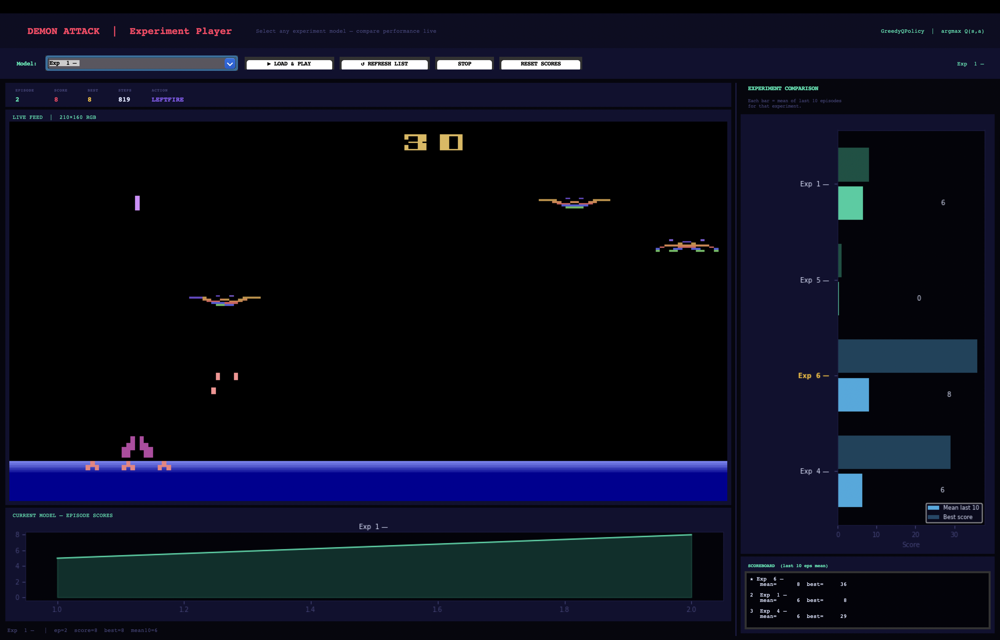

# Formative 3 — Deep Q-Learning on ALE/DemonAttack-v5

**Student:** Gatwaza  
**Environment:** `ALE/DemonAttack-v5`  
**Algorithm:** Deep Q-Network (DQN) — Stable Baselines 3  
**Policy:** `CnnPolicy` (Convolutional Neural Network) — all 10 experiments  

---

## 1. Environment

| Property | Value |
|---|---|
| Environment ID | `ALE/DemonAttack-v5` |
| Action Space | `Discrete(6)` — NOOP, FIRE, RIGHT, LEFT, RIGHTFIRE, LEFTFIRE |
| Raw Observation | `Box(0, 255, (210, 160, 3), uint8)` |
| Preprocessed Input | `(84, 84, 4)` — grayscale + 4 stacked frames via `VecFrameStack` |
| Frameskip | 4 |
| Repeat Action Probability | 0.25 |

**Reward:** Points per demon destroyed. Agent begins with 3 bunkers (max 6). Each hit destroys one bunker; game ends on the next hit after all bunkers are lost.

---

## 2. Installation

```bash
pip3 install stable-baselines3 "gymnasium[atari,accept-rom-license]" \
             ale-py autorom pillow matplotlib opencv-python tensorboard
AutoROM --accept-license
```

Verify:
```bash
python3 -c "import ale_py, gymnasium as gym; gym.register_envs(ale_py); \
env = gym.make('ALE/DemonAttack-v5'); obs,_=env.reset(); \
print('OK — obs shape:', obs.shape); env.close()"
```

---

## 3. Project Files

| File | Purpose |
|---|---|
| `train.py` | Single training run with CLI flags |
| `run_experiments.py` | Runs all 10 experiments automatically, resumable on crash |
| `play.py` | Evaluation GUI — experiment selector, live feed, comparison chart |
| `dqn_best.zip` | Best performing model (Exp 6 — Large Batch) |
| `dqn_latest.zip` | Most recent checkpoint |
| `hyperparameter_experiments.csv` | Full results log |
| `logs/` | Per-experiment reward charts and models |

---

## 4. How to Run

**Run all 10 experiments:**
```bash
python3 run_experiments.py --timesteps 500000 --member "Gatwaza"
```

**Single custom run:**
```bash
python3 train.py --lr 0.0001 --gamma 0.99 --batch 32 --n-envs 4 --timesteps 1000000
```

**Play and compare experiments:**
```bash
python3 play.py --model dqn_best.zip
```

**Crash recovery** — re-run the same command; completed experiments are skipped automatically via `experiments_checkpoint.json`.

---

## 5. Hyperparameter Experiments — Gatwaza

All experiments use `CnnPolicy`, `n_envs=4`, `500,000` timesteps. Total runtime: **665.3 minutes**.

### 5.1 Results

| # | Label | lr | gamma | batch | eps_end | eps_decay | Mean | Best | Last-20 |
|---|---|---|---|---|---|---|---|---|---|
| 1 | Baseline | 0.0001 | 0.99 | 32 | 0.01 | 0.10 | 376.8 | 2475.0 | 468.0 |
| 2 | High LR | 0.001 | 0.99 | 32 | 0.01 | 0.10 | 297.6 | 2070.0 | 525.8 |
| 3 | Low LR | 0.00001 | 0.99 | 32 | 0.01 | 0.10 | 376.3 | 2355.0 | 366.5 |
| 4 | Low Gamma | 0.0001 | 0.90 | 32 | 0.01 | 0.10 | 385.2 | 3620.0 | 792.0 |
| 5 | High Gamma | 0.0001 | 0.999 | 32 | 0.01 | 0.10 | 302.8 | 3110.0 | 288.5 |
| 6 | **Large Batch ★** | 0.0001 | 0.99 | **128** | 0.01 | 0.10 | **856.5** | **7330.0** | **1566.8** |
| 7 | Small Batch | 0.0001 | 0.99 | 16 | 0.01 | 0.10 | 322.8 | 2000.0 | 351.8 |
| 8 | High Eps End | 0.0001 | 0.99 | 32 | **0.10** | 0.10 | 278.9 | 2505.0 | 530.2 |
| 9 | Slow Eps Decay | 0.0001 | 0.99 | 32 | 0.01 | **0.50** | 311.1 | 3130.0 | 724.0 |
| 10 | Best Guess | 0.0005 | 0.995 | 64 | 0.01 | 0.15 | 862.9 | 5000.0 | 1348.8 |

**★ Best experiment: #6 — Large Batch (last-20 mean = 1566.8)**

### 5.2 Observations

**Exp 1 — Baseline:** Reference point. Consistent learning with moderate scores. last-20 (468) exceeds mean (376.8) confirming active improvement at end of training.

**Exp 2 — High LR:** Low overall mean (297.6) indicates early instability from large gradient steps, but last-20 (525.8) recovers above baseline, suggesting eventual convergence.

**Exp 3 — Low LR:** last-20 (366.5) ≈ mean (376.3), indicating the agent never meaningfully improved. Learning rate too small for useful weight updates within 500k steps.

**Exp 4 — Low Gamma:** Contrary to hypothesis, gamma=0.90 outperformed baseline (last-20=792.0). Short-sighted reward maximisation aligns with DemonAttack's immediate-firing scoring structure.

**Exp 5 — High Gamma:** last-20 (288.5) < mean (302.8) — agent regressed during training. gamma=0.999 requires far more timesteps to form coherent long-term strategies; 500k is insufficient.

**Exp 6 — Large Batch ★:** Dominant result. batch=128 produced last-20=1566.8 (3.3× baseline), best=7330.0, and the lowest episode count (1146), indicating longest survival. Smoother gradient estimates from larger batches are highly beneficial for pixel-based spatial targeting.

**Exp 7 — Small Batch:** batch=16 produced the noisiest gradients. last-20 (351.8) below baseline, confirming that insufficient batch diversity harms learning stability.

**Exp 8 — High Eps End:** Maintaining 10% random exploration permanently (eps_end=0.10) reduces exploitation of learned policy, limiting last-20 to 530.2 despite reasonable best score (2505.0).

**Exp 9 — Slow Eps Decay:** eps_decay=0.50 delays exploitation until the second half of training. last-20=724.0 — better than baseline, suggesting broader exploration improved strategy diversity before converging.

**Exp 10 — Best Guess Combined:** Second-best overall (last-20=1348.8, best=5000.0). Moderate lr increase (0.0005) combined with batch=64 and gamma=0.995 produced strong results, validating combined tuning as an effective approach.

### 5.3 Key Findings

1. **Batch size is the most impactful hyperparameter** — batch=128 outperformed all others by a significant margin.
2. **Low gamma (0.90) suits DemonAttack** — immediate reward maximisation matches the game's wave-based scoring.
3. **High gamma (0.999) requires more timesteps** — long-term planning cannot be learned in 500k steps.
4. **Training duration matters** — the GUI run with identical baseline settings but 1M steps achieved last-20=1100 vs 468 at 500k, demonstrating that all experiments would benefit from extended training.

---

## 6. Policy: CnnPolicy vs MlpPolicy

`CnnPolicy` was used exclusively across all 10 experiments. The observation space after preprocessing is `(84, 84, 4)` — a spatial image tensor. A CNN learns spatial filters to detect demons, bullets, and the player across pixel positions, which is essential for accurate targeting. An MLP would flatten this into a 28,224-dimensional vector, losing all spatial relationships. All foundational DQN Atari papers (Mnih et al., 2013, 2015) establish CNN as the required architecture for pixel-based environments.

`MlpPolicy` is available via `--policy MlpPolicy` for comparison but was not used in the core experiments to maintain single-variable isolation per experiment. A dedicated CNN vs MLP comparison is assigned to a separate group member.

---

## 7. Screenshots

### Training in Progress


*Simultaneous training (left) and live agent play (right) via `atari_dqn_gui.py`. Left shows reward chart and progress bar; right shows live game feed with auto-reloading checkpoint.*

---

### Agent Playing — Experiment Selector



*`play.py` experiment selector showing live game feed, per-experiment episode scores, and comparison bar chart across all tested models.*

---

### Experiment Summary Chart


*Grouped bar chart comparing mean score, best score, and last-20-episode mean across all 10 experiments. Generated by `run_experiments.py`.*

---

## 8. Considerations

**Memory:** A `UserWarning` about replay buffer size may appear. This is a worst-case estimate; actual usage is well within limits due to `VecFrameStack` compressing observations from `(210,160,3)` to `(84,84,4)`.

**macOS:** `DummyVecEnv` is used automatically on macOS instead of `SubprocVecEnv` due to Python's `spawn` multiprocessing constraint. Training is slightly slower than Linux but functionally identical.

**Observation pipeline:**
```
(210,160,3) RGB → NoopReset → MaxAndSkip → EpisodicLife →
FireReset → ClipReward → WarpFrame(84,84) → VecFrameStack(4) → (84,84,4)
```

**GreedyQPolicy:** During evaluation, `action = argmax Q(s,a)` with `deterministic=True`. No exploration is applied; the agent always selects the highest Q-value action.

---

*Formative 3 — Deep Q-Learning | ALE/DemonAttack-v5 | Stable Baselines 3*