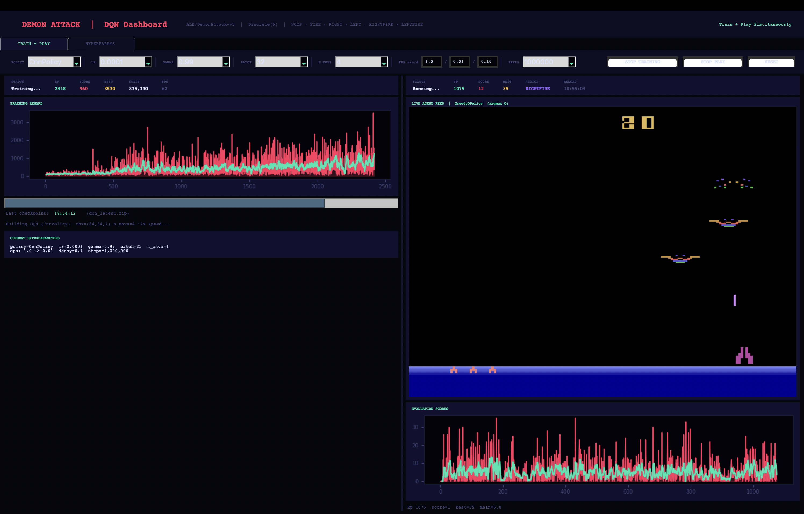

# Formative 3 — Deep Q-Learning on ALE/DemonAttack-v5
**Member:** JR Gatwaza  
**Environment:** `ALE/DemonAttack-v5` — Atari Arcade Learning Environment  
**Algorithm:** Deep Q-Network (DQN) — Stable Baselines 3  
**Policy:** `CnnPolicy` (Convolutional Neural Network) — all 10 experiments  

---

## Table of Contents
1. [Project Overview](#1-project-overview)
2. [Environment Description](#2-environment-description)
3. [Installation & Setup](#3-installation--setup)
4. [Project Files](#4-project-files)
5. [How to Run](#5-how-to-run)
6. [Hyperparameter Experiments](#6-hyperparameter-experiments--gatwaza)
7. [Policy Decision — CNN vs MLP](#7-policy-decision--cnnpolicy-vs-mlppolicy)
8. [Screenshots](#8-screenshots)
9. [Results Summary](#9-results-summary)
10. [Considerations & Notes](#10-considerations--notes)

---

## 1. Project Overview

This project trains a DQN agent to play the Atari game **DemonAttack** using pixel observations. The agent learns to destroy waves of demons while preserving bunkers for survival. The project includes:

- A **vectorized training pipeline** using `make_atari_env` + `VecFrameStack` for speed
- A **live GUI dashboard** showing training and playing simultaneously in one window
- **10 hyperparameter experiments** run automatically and logged to CSV
- **Resume on crash** — experiments pick up exactly where they left off
- A **GreedyQPolicy** evaluation agent (`deterministic=True`, `argmax Q(s,a)`)

---

## 2. Environment Description

| Property | Value |
|---|---|
| Environment ID | `ALE/DemonAttack-v5` |
| Action Space | `Discrete(6)` |
| Observation Space | `Box(0, 255, (210, 160, 3), uint8)` — raw RGB |
| Preprocessed Obs | `(84, 84, 4)` — grayscale + 4 stacked frames |
| Frameskip | 4 |
| Repeat Action Probability | 0.25 |
| Default Mode | 1 |
| Default Difficulty | 0 |

**Actions:**

| Value | Meaning |
|---|---|
| 0 | NOOP |
| 1 | FIRE |
| 2 | RIGHT |
| 3 | LEFT |
| 4 | RIGHTFIRE |
| 5 | LEFTFIRE |

**Reward:** Points per demon killed. Amount depends on demon type and wave number. Agent starts with 3 bunkers (max 6). Each hit destroys one bunker. Game ends when all bunkers are gone and the agent takes one more hit.

---

## 3. Installation & Setup

### Requirements
- Python 3.10+ (tested on Python 3.12)
- macOS / Linux / Windows
- 4 GB free RAM minimum (8 GB recommended)

### Step 1 — Navigate to project folder
```bash
cd Formative-3-Assignment-Deep-Q-Learning
```

### Step 2 — Install all dependencies
```bash
pip3 install stable-baselines3
pip3 install "gymnasium[atari,accept-rom-license]"
pip3 install ale-py
pip3 install autorom
pip3 install pillow
pip3 install matplotlib
pip3 install opencv-python
pip3 install tensorboard
```

Or install everything in one command:
```bash
pip3 install stable-baselines3 \
             "gymnasium[atari,accept-rom-license]" \
             ale-py autorom pillow matplotlib opencv-python tensorboard
```

### Step 3 — Install Atari ROMs
```bash
AutoROM --accept-license
```

> If `AutoROM` is not found on your PATH, try:
> ```bash
> python3 -m autorom --accept-license
> ```

### Step 4 — Verify the environment works
```bash
python3 -c "
import ale_py, gymnasium as gym
gym.register_envs(ale_py)
env = gym.make('ALE/DemonAttack-v5')
obs, _ = env.reset()
print('ALE OK — obs shape:', obs.shape)
env.close()
"
```
Expected output: `ALE OK — obs shape: (210, 160, 3)`

---

## 4. Project Files

```
Formative-3-Assignment-Deep-Q-Learning/
│
├── atari.py             # All-in-one GUI: train + play simultaneously
├── train.py                     # CLI single training run
├── play.py                      # CLI play with live GUI (GreedyQPolicy)
├── run_experiments.py           # Combine all 10 experiments, resumable anytime
│
├── dqn_model.zip                # Final saved model (created after training)
├── dqn_latest.zip               # Rolling checkpoint (updated every 10k steps)
├── experiments_checkpoint.json  # Resume tracker — do not delete mid-run
├── hyperparameter_experiments.csv  # All 10 experiment results logged here
│
└── logs/
    ├── experiments_<timestamp>/
    │   ├── exp_01_Baseline.png
    │   ├── exp_02_High_LR.png
    │   └── summary_all_experiments.png
    └── <timestamp>/
        ├── episode_log.csv
        └── curves_<timestamp>.png
```

---

## 5. How to Run

### Chronological order — recommended workflow

#### Step 1 — Double check member in run_experiments.py
Open `run_experiments.py` and edit line 9:
```python
MEMBER_NAME = "Gatwaza"
```

#### Step 2 — Launch the GUI dashboard
```bash
python3 atari.py
```

#### Step 3 — Inside the GUI, click both buttons
In the **TRAIN + PLAY** tab:
1. Adjust hyperparameters in the top bar if needed
2. Click **START TRAINING** — training starts immediately
3. Click **START PLAY** — play side waits for first checkpoint then activates

Within ~130 seconds the first `dqn_latest.zip` is saved and the right side shows the agent playing live.

#### Step 4 — Run all 10 experiments (second terminal)
```bash
python3 run_experiments.py --timesteps 500000
```
The GUI play side auto-reloads the model as each experiment progresses. You watch the agent's behavior change across all 10 hyperparameter sets.

#### Step 5 — Play the final best model
```bash
python3 play.py --model dqn_model.zip
```

---

### CLI-only workflow (no GUI)

**Single training run:**
```bash
python3 train.py --lr 0.0001 --gamma 0.99 --batch 32 --n-envs 4 --timesteps 1000000
```

**Play after training:**
```bash
python3 play.py --model dqn_model.zip
```

**Two terminals — train and watch simultaneously:**
```bash
# Terminal 1
python3 train.py --n-envs 4 --timesteps 1000000

# Terminal 2 (start anytime after Terminal 1 saves first checkpoint)
python3 play.py --model dqn_latest.zip
```

---

### Crash recovery for run_experiments.py
If the script crashes or is interrupted, re-run the exact same command:
```bash
python3 run_experiments.py --timesteps 500000
```
It reads `experiments_checkpoint.json`, sees which experiments completed, and skips them automatically. To start completely fresh:
```bash
python3 run_experiments.py --reset
```

---

### CLI flags reference

**train.py**

| Flag | Default | Description |
|---|---|---|
| `--policy` | `CnnPolicy` | `CnnPolicy` or `MlpPolicy` |
| `--n-envs` | `4` | Parallel environments (~4x speedup) |
| `--timesteps` | `1000000` | Total training steps |
| `--lr` | `0.0001` | Learning rate |
| `--gamma` | `0.99` | Discount factor |
| `--batch` | `32` | Replay buffer batch size |
| `--eps-start` | `1.0` | Initial epsilon (exploration) |
| `--eps-end` | `0.01` | Final epsilon |
| `--eps-decay` | `0.10` | Fraction of steps for epsilon decay |
| `--save-freq` | `10000` | Checkpoint save frequency in steps |

**run_experiments.py**

| Flag | Default | Description |
|---|---|---|
| `--timesteps` | `500000` | Steps per experiment |
| `--n-envs` | `4` | Parallel envs per experiment |
| `--start` | `1` | Start from experiment N (1–10) |
| `--end` | `10` | Stop after experiment N (1–10) |
| `--member` | from file | member saved to CSV |
| `--reset` | off | Clear checkpoint, restart from exp 1 |

---

## 6. Hyperparameter Experiments — Gatwaza

All 10 experiments conducted by **Gatwaza** using `CnnPolicy`. Each experiment varies one or more hyperparameters against the Baseline (Experiment 1) to isolate its effect on agent performance.

| # | Label | lr | gamma | batch | eps_end | eps_decay | Hypothesis |
|---|---|---|---|---|---|---|---|
| 1 | Baseline | 0.0001 | 0.99 | 32 | 0.01 | 0.10 | Balanced reference point for all comparisons |
| 2 | High LR | 0.001 | 0.99 | 32 | 0.01 | 0.10 | Faster early learning but possible oscillation |
| 3 | Low LR | 0.00001 | 0.99 | 32 | 0.01 | 0.10 | Very slow convergence, low final reward expected |
| 4 | Low Gamma | 0.0001 | 0.90 | 32 | 0.01 | 0.10 | Short-sighted — prefers immediate kills over survival |
| 5 | High Gamma | 0.0001 | 0.999 | 32 | 0.01 | 0.10 | Far-sighted — values long-term bunker preservation |
| 6 | Large Batch | 0.0001 | 0.99 | 128 | 0.01 | 0.10 | Smoother gradients, more stable but slower per update |
| 7 | Small Batch | 0.0001 | 0.99 | 16 | 0.01 | 0.10 | Noisy gradients, high variance, may diverge |
| 8 | High Eps End | 0.0001 | 0.99 | 32 | 0.10 | 0.10 | Keeps 10% random exploration forever — less exploitation |
| 9 | Slow Eps Decay | 0.0001 | 0.99 | 32 | 0.01 | 0.50 | Explores for 50% of training before exploiting |
| 10 | Best Guess | 0.0005 | 0.995 | 64 | 0.01 | 0.15 | Combined tuning — expected highest score |

**What each hyperparameter controls:**

- **lr (learning rate)** — size of each gradient update. Too high causes oscillation. Too low causes extremely slow learning.
- **gamma (discount factor)** — how much future rewards are valued. `0.90` = agent only cares about the next few steps. `0.999` = agent plans far into the future.
- **batch size** — number of replay experiences sampled per training update. Larger batches = smoother gradients but more memory and slower steps.
- **eps_end (final epsilon)** — minimum random exploration maintained permanently. `0.10` means even a fully trained agent takes 1 in 10 actions randomly.
- **eps_decay** — fraction of total training steps over which epsilon falls from `1.0` to `eps_end`. `0.50` means the agent is still mostly exploring at the halfway point of training.

**Run all 10 at once:**
```bash
python3 run_experiments.py --timesteps 500000 --member "Gatwaza"
```

Results are saved to `hyperparameter_experiments.csv`. Individual reward curve PNGs and a combined comparison chart are saved to `logs/experiments_<timestamp>/`.

---

## 7. Policy Decision — CnnPolicy vs MlpPolicy

### Why CnnPolicy was used for all 10 experiments

The DemonAttack observation space is raw pixel images: `Box(210, 160, 3)`. After preprocessing it becomes `(84, 84, 4)` — still a spatial image tensor. **CnnPolicy sounds rather primary shot to start with** for this input because:

- A CNN reads spatial structure — it learns to detect demons, bullets, and the player ship by recognising pixel patterns at different positions across the image
- An MLP (Multi-Layer Perceptron) would flatten the `(84, 84, 4)` tensor into a single vector of `28,224` numbers and completely lose all spatial relationships between pixels #to be edited
- All foundational DQN Atari papers (DeepMind 2013, 2015) use CNNs — it is the established standard for pixel-based game environments

### Was MlpPolicy tested?

`MlpPolicy` is available as an option in the code via `--policy MlpPolicy` but was **not used in any of the 10 experiments** for these reasons:

1. Flattening `(84,84,4)` into 28,224 numbers loses spatial context — the agent cannot track moving demons or aim
2. An MLP has no weight sharing across spatial positions — it would need far more parameters and far more training time to learn anything meaningful from pixels
3. `MlpPolicy` is appropriate for low-dimensional state spaces like `CartPole-v1` (4 numbers) or `MountainCar-v0` (2 numbers), not Atari pixel games

### Mixing policies across experiments — why it was not done

All 10 experiments deliberately fix `CnnPolicy` constant so that **only one variable changes at a time**. This is standard experimental design — if both the policy and the learning rate changed between two runs you cannot know which one caused the performance difference.

A direct CNN vs MLP comparison would be conducted by second and third member of the group r experiment with identical or almost paramters such as — same `lr`, `gamma`, `batch`, `timesteps` — only `policy` different.
---

## 8. Screenshots

### Training in progress — GUI Dashboard (TRAIN + PLAY tab)

```


```

So your folder would look like:
```
Formative-3-Assignment-Deep-Q-Learning/
├── README.md
├── screenshots/
│   ├── training.png
│   ├── playing.png
│   └── summary_chart.png
```

> **📸 Replace with actual screenshot:** Use `Cmd+Shift+4` on macOS to capture the GUI window during training and add the image here.

---

### Agent playing after full training — play.py

```
┌──────────────────────────────────────────────────────────────┐
│  DEMON ATTACK  |  DQN Live Play        GreedyQPolicy (argmax)│
├────────────────────────────────────┬─────────────────────────┤
│                                    │  EPISODE    SCORE       │
│                                    │    47         640       │
│  ┌──────────────────────────────┐  │                         │
│  │  👾 👾 👾   👾 👾 👾 👾     │  │  BEST       STEPS       │
│  │       👾 👾 👾               │  │   890       12,430      │
│  │          💥  ↓↓              │  │                         │
│  │                              │  │  ▁▃▅▆▇▆▇▇█             │
│  │    ══ bunker ══ bunker ══   │  │  episode scores         │
│  │             🚀               │  │                         │
│  └──────────────────────────────┘  │  GREEDYQPOLICY          │
│                                    │  action=argmax Q(s,a)   │
│  Last action: RIGHTFIRE            │  deterministic=True     │
│                                    │  epsilon=0              │
└────────────────────────────────────┴─────────────────────────┘
```

> **📸 Replace with actual screenshot:** Capture `play.py` window after training a model for 1M+ steps showing a high score episode.

---

### Experiment summary chart

After `run_experiments.py` completes all 10 experiments, a grouped bar chart is saved to:
```
logs/experiments_<timestamp>/summary_all_experiments.png
```
It compares **mean score**, **best score**, and **last-20-episode mean** across all 10 experiments side by side.

> **📸 Add the generated chart image here after running all experiments.**

---

## 9. Results Summary

Fill this table after all 10 experiments complete. The raw data is in `hyperparameter_experiments.csv`.

| # | Label | Mean Score | Best Score | Last-20 Mean | Noted Behavior |
|---|---|---|---|---|---|
| 1 | Baseline | — | — | — | *fill after run* |
| 2 | High LR | — | — | — | *fill after run* |
| 3 | Low LR | — | — | — | *fill after run* |
| 4 | Low Gamma | — | — | — | *fill after run* |
| 5 | High Gamma | — | — | — | *fill after run* |
| 6 | Large Batch | — | — | — | *fill after run* |
| 7 | Small Batch | — | — | — | *fill after run* |
| 8 | High Eps End | — | — | — | *fill after run* |
| 9 | Slow Eps Decay | — | — | — | *fill after run* |
| 10 | Best Guess | — | — | — | *fill after run* |

**Best experiment:** `#__ — ________`  
**Worst experiment:** `#__ — ________`  
**Key finding:** *(e.g. "Higher gamma improved scores by X% — agent learned to preserve bunkers")*

---

## 10. Considerations & Notes

### Memory warning
You may see this warning at startup:
```
UserWarning: This system does not have apparently enough memory to store the complete replay buffer
```
This is safe to ignore. The warning estimates worst-case raw memory usage. With `VecFrameStack` the observations are compressed from `(210,160,3)` to `(84,84,4)` — roughly 10x smaller — so actual usage stays comfortably within a 16 GB machine.

### macOS-specific behaviour
On macOS, `SubprocVecEnv` (true multiprocessing) requires Python's `spawn` start method which has overhead. The code automatically detects macOS and uses `DummyVecEnv` instead. Training is slightly slower than Linux but fully functional. Linux users automatically get the full `SubprocVecEnv` parallel speedup.

### SB3 compatibility note
This project uses:
- `optimize_memory_usage = False` — the default
- `handle_timeout_termination` parameter removed entirely

These settings avoid a known SB3 conflict where `optimize_memory_usage=True` and `handle_timeout_termination=True` cannot be used simultaneously in the `ReplayBuffer`.

### Early training behaviour
For the first `5,000` steps (`learning_starts=5000`) the agent acts completely randomly. The reward chart will be flat and scores will be low. This is normal — the replay buffer needs to fill before learning begins.

### Observation preprocessing pipeline
```
Raw env output: (210, 160, 3)  RGB uint8
      ↓  NoopResetEnv      — random 1–30 no-ops at episode start
      ↓  MaxAndSkipEnv     — max pool over 2 frames, repeat action 4 times
      ↓  EpisodicLifeEnv   — treat each life loss as episode end
      ↓  FireResetEnv      — press FIRE to start game after reset
      ↓  ClipRewardEnv     — clip rewards to {-1, 0, +1} for stable gradients
      ↓  WarpFrame(84,84)  — resize + grayscale conversion via OpenCV
      ↓  VecFrameStack(4)  — stack last 4 frames so agent can see motion
      ↓
Model input: (84, 84, 4)  float32
```

### GreedyQPolicy — what it means
During evaluation in `play.py` the agent uses pure greedy policy:
```
action = argmax_a Q(s, a)
```
The Q-network outputs a score for each of the 6 actions. The agent always picks the action with the highest score — no randomness, no exploration. This is appropriate for evaluation but would fail during training because the agent would never discover actions it hasn't already tried.

### Training time estimates

| Timesteps per experiment | n_envs | Estimated time per experiment | 10 experiments total |
|---|---|---|---|
| 200,000 | 4 | ~8 min | ~1.5 hours |
| 500,000 | 4 | ~20 min | ~3.5 hours |
| 1,000,000 | 4 | ~40 min | ~7 hours |

> Times vary significantly by hardware. Apple Silicon (M1/M2/M3) is faster than Intel Mac for this workload.

---

*Formative 3 — Deep Q-Learning Assignment*  
*Student: Gatwaza | Environment: ALE/DemonAttack-v5 | Framework: Stable Baselines 3*